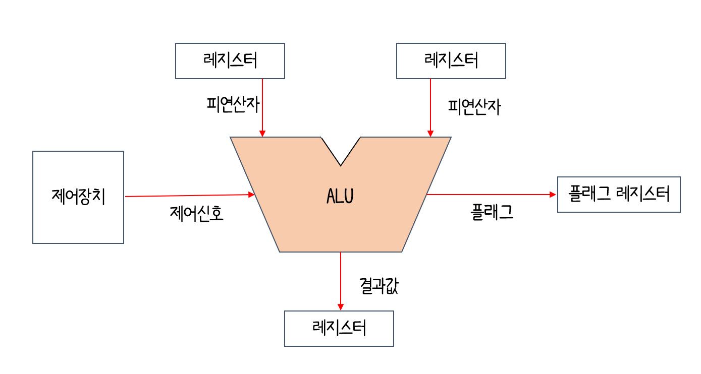
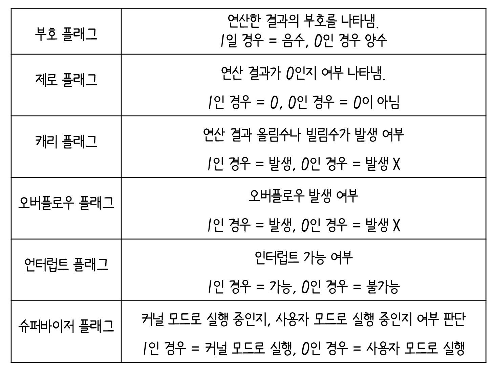
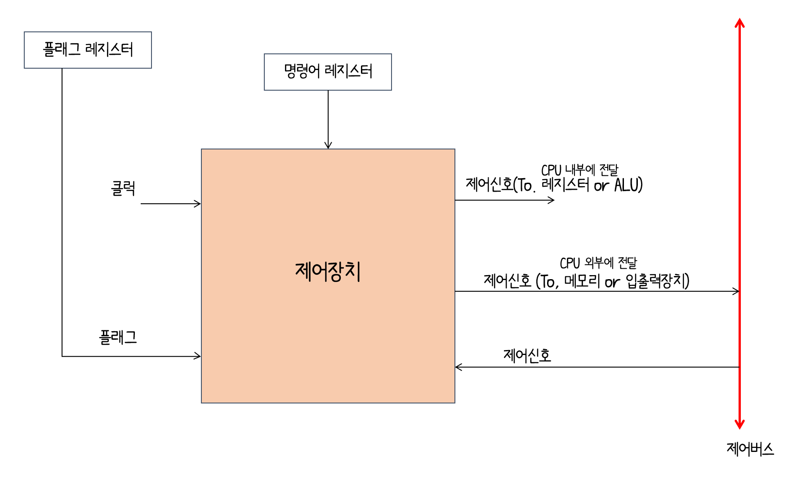

# ALU

- `ALU`는 연산한 결과값과 플래그를 내보냄.

- 레지스터로부터 피연산자를 받아들이고 제어장치로부터 제이신호를 받아들임.

- CPU가 메모리에 접근하는 속도 < 레지스터에 접근하는 속도 :arrow_right: 일시적으로 레지스터에 저장

- `플래그` : 연산 결과에 대한 추가적인 상태 정보

  

- `플래그 레지스터 ` : 플래그들을 저장하는 레지스터

---

# 제어장치

`제어장치` : 제어 신호를 내보내고, 명령어를 해석하는 부품

`제어 신호` : 컴퓨터 부품들을 관리하고 작동시키기 위한 전기 신호

**1. 제어장치는 클럭 신호를 받아들임.**

- `클럭` : 컴퓨터의 모든 부품을 일사불란하게 움직일 수 있게 하는 시간 단위

**2.  제어장치는 `명령어 레지스터`로부터 해석해야 할 명령어를 받아들임.**

**3. 제어장치는 `플래그레지스터` 속 플래그 값을 받아들임.**

**4. 제어장치는 `제어 버스`로 전달된 제어 신호를 받아들임**