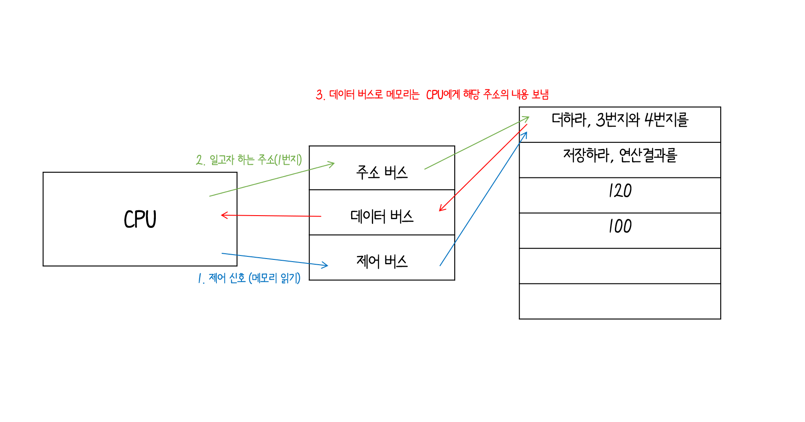
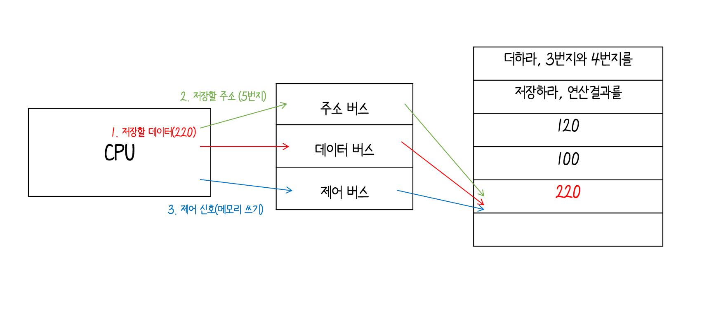

# 1. 컴퓨터 구조 시작하기 :desktop_computer:


## 1-1 컴퓨터 구조를 알아야 하는 이유

<span style="color:#808080">~~사실 이 내용 귀찮아서 목차를 따로 만들까 말까 고민했지만 그냥 넣은 내용~~</span>

- 컴퓨터 구조를 이해하면 문제해결 능력 :arrow_up:
- 문법만으로 알기 어려운 `성능/ 용량/ 비용` 을 고려하며 개발 :o:


---


## 1-2 컴퓨터 구조의 큰 그림

### <b>컴퓨터가 이해하는 정보</b>

` 데이터`<sup>data</sup> 

: 컴퓨터가 이해하는 숫자, 문자, 이미지, 동영상과 같은 정적인 정보

` 명령어`

: 실질적으로 작동시키는 더 중요한 정보, <u>데이터를 움직이고 컴퓨터를 작동시키는 정보</u>이기 때문에 데이터는 명령어 없이는 아무것도 할 수 없는 정보 덩어리

---

### 컴퓨터의 네 가지 핵심 부품

`메모리`

: 현재 실행되는 프로그램의 명령어와 데이터를 저장하는 부품, 저장된 값에 빠르고 효율적으로 접근하기 위해서 <u>주소</u><sup>address</sup>를 이용

`CPU`

: 산술논리연산장치<sup>ALU</sup>, 레지스터, 제어장치로 구성

​		ALU :arrow_right: 계산만을 위해서 존재하는 부품, 컴퓨터 내부에서 수행되는 대부분의 계산을 맡음

​		레지스터 :arrow_right: CPU 내부의 작은 임시 저장 장치, 여러 개의 레지스터가 존재하고 각기 다른 이름과 역할을 지님

​		제어장치 :arrow_right: <u>제어 신호</u>라는 전기 신호를 내보내고 명령어를 해석하는 장치

​							   메모리 읽기 : 메모리에 저장된 값을 읽고 싶을 때 보내는 제어 신호

​							   메모리 쓰기 : 메모리에 어떤 값을 저장하고 싶을 때 보내는 제어 신호

 ` 보조기억장치`

: 메모리보다 크기가 크고 전원이 꺼져도 저장된 내용을 잃지 않는 메모리( SSD, USB, 메모리,DVD, CD-ROM 등)

` 입출력장치`

: 컴퓨터 내부와 정보를 교환하는 장치를 의미(마이크, 스피커, 프린터, 마우스, 키보드 등)


<span style = "color : #808080">// 보조 기억장치인 하드 디스크, USB등 이런 것도 입출력 장치로 볼 수 있는데 보조기억장치는 관점에 따라 입출력장치의 일종으로 볼 수 있는데 그래서 '주변장치'라 통칭하기도 함.</span>

---

### 메인보드와 시스템 버스

```메인 보드```

: 모든 핵심 부품들은 모두 메인 보드에 연결됨, 마더보드라고도 함

`버스`

: 메인보드 내부에서 메인보드에 연결된 부품들이 서로 정보를 주고 받을 수 있게 하는 통로

`시스템 버스`

: 핵심 부품들을 연결하는 가장 중요한 버스

​	주소 버스 :arrow_right: 주소를 주고 받는 통로

​	데이터 버스 :arrow_right:명령어와 데이터를 주고 받는 버스

​	제어 버스 :arrow_right:제어 신호를 주고 받는 버스






​				