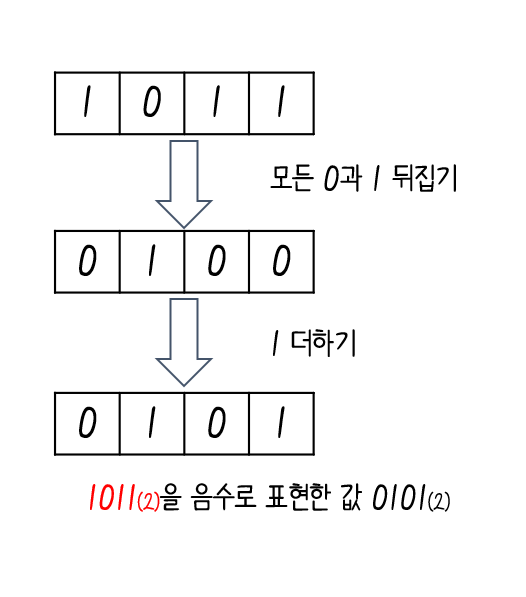
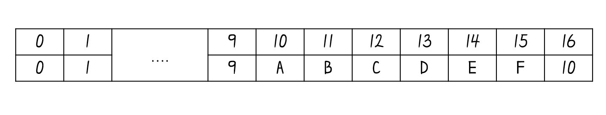
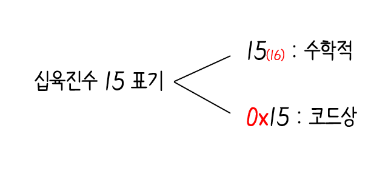
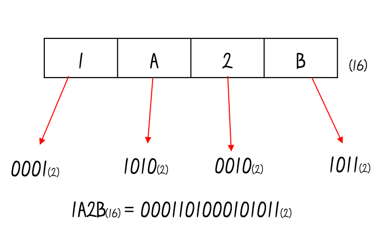
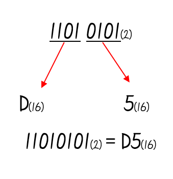
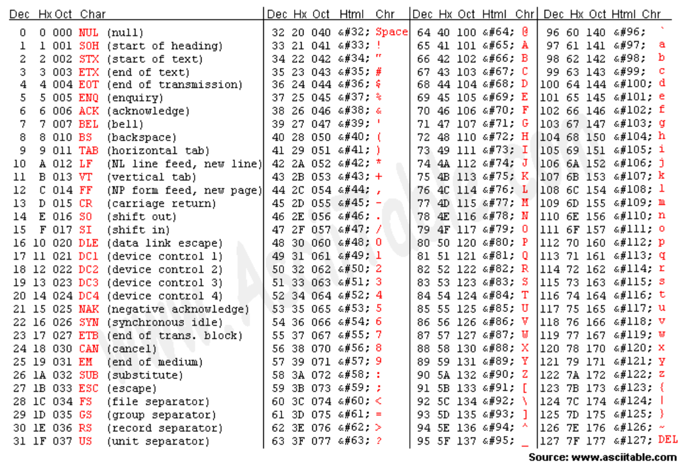

# 2. 데이터 :desktop_computer:

## 2 - 1 0과 1로 숫자를 표현하는 방법

컴퓨터는 0과 1로 모든 정보를 표현하고, 0과 1로 표현된 정보만을 이해:o:

### 정보 단위

`비트(bit)`

: 0과 1을 나타내는 가장 적은 정보 단위, <u>n비트는 2n</u>가지 정보를 표현 :o:

`바이트(byte)`

: 여덟 개의 비트를 묶은 단위, 1 바이트 = 8 비트 이기 때문에 28= 256개의 정보 표현 :o:

- 1바이트 (1byte) = 8비트(8bit)
- 1킬로바이트(1kB) = 1000바이트(1000byte)
- 1메가바이트(1MB) = 1000킬로바이트(1000kB)
- 1기가바이트(1GB) = 1000메가바이트(1000MB)
- 1테라바이트(1TB) = 1000기가바이트(1000GB)

`워드(word)`

: CPU가 한 번에 처리할 수 있는 데이터의 크기

// 만약 CPU가 한 번에 16비트를 처리하면 1워드는 16비트가 되고, 32비트이면 1워드는 32비트

`하프워드`

: 정의된 워드의 절반

`풀 워드`, `더블 워드`

: 1배 크기를 풀 워드, 2배 크기를 더블 워드라고 함

---

### 이진법

`십진법(decimal)`

: 숫자가 9를 넘어가는 시점에서 자리 올림을 하여 0부터 9까지, 열 개의 숫자만으로 모든 수를 표현

`이진법(binary)`

: 0과 1만으로 모든 숫자를 표현

#### 이진수의 음수 표현

`2의 보수(two's complement)`

:  1의 보수 + 1

`플래그(flag)`

: 이진수만 보면 음수와 양수를 구분하기 힘들기에 컴퓨터 내부에서 어떤 수를 다룰 때 이수가 양수인지 음수인지 구분하기 위해 사용

`2의 보수 표현의 한계`

- 0000(2)을 2의 보수를 나타내면 10000(2)가 나오게 됨 :arrow_right: 올림이 발생한 비트의 1을 버림
- 1000(2)을 2의 보수로 나타내면 1000(2) 자기 자신이 나오게 되어서 본질적으로 해결 :x:

---

### 십육진법

`십육진법(hexadecimal)`

: 수가 15가 넘어가는 시점에 자리 올림을 하는 숫자 표현 방식, 십육진법을 사용하는 주된 이유 중 하나는 이진수를 십육진수로, 십육진수를 이진수로 변환하기 쉽기 때문

#### 십육진수를 이진수로 변환하기

: 16진수 한 글자를 4비트의 이진수로 간주하여 각 글자를 따로따로 이진수로 변환 후 이어 붙이면 변환 완료

#### 이진수를 십육진수로 변환하기

: 이진수 숫자를 네 개씩 끊고, 끊어 준 네 개의 숫자를 하나의 십육진수로 변환한 뒤 이어 붙이면 변환 완료

---

## 2 - 2 0과 1로 문자를 표현하는 방법

### 문자 집합과 인코딩

`문자 집합(character set)`

: 컴퓨터가 인식하고 표현할 수 있는 문자 모음

`문자 인코딩(character encoding`)

: 문자를 0과 1로 변환하는 과정

`문자 디코딩(character decoding)`

:  0과 1로 이루어진 문자 코드를 문자로 변환하는 과정

---

### 아스키 코드

`아스키 코드`

- 초창기의 문자 집합, 아스키 문자 집합에 속한 문자들은 각각 7비트로 표현
- 표현할 수 있는 정보의 가짓수는 128( = 27)개
- 인코딩이 매우 빠르다는 장점을 가지지만 한글과 특수 문자 같이 아스키 문자 집합에 없는 문자는 할 수 없음

---

### EUC-KR

`완성형 인코딩`

: 초성, 중성, 종성의 조합으로 이루어진 완성된 하나의 글자에 고유한 코드를 부여하는 인코딩 방식

`초하형 인코딩`

: 초성을 위한 비트열, 중성을 위한 비트열, 종성을 위한 비트열을 할당하여 그것들의 조합으로 하나의 글자 코드를 완성하는 인코딩 방식

`EUC-KR`

: 초성, 중성, 종성 모두 결합된 한글 단어에 2바이트 크기를 부여

---

### 유니코드와 UTF-8

`유니코드(umicode)`

: 여러 나라의 문자를 광범위하게 표현할 수 있는 통일된 문자 집합

`UTF-8`

: 유니코드를 글자에 부여된 값 자체를 인코딩된 값으로 삼지 않고 이 값을 다양한 방법으로 인코딩하는 방법

