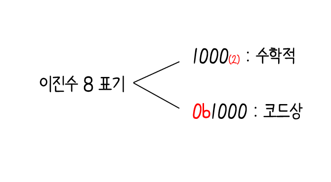

# 2. 데이터 :desktop_computer:

## 2-1 0과 1로 숫자를 표현하는 방법

컴퓨터는 0과 1로 모든 정보를 표현하고, 0과 1로 표현된 정보만을 이해:o:

### 정보 단위

`비트(bit)`

: 0과 1을 나타내는 가장 적은 정보 단위, <u>n비트는 2n</u>가지 정보를 표현 :o:

`바이트(byte)`

: 여덟 개의 비트를 묶은 단위, 1 바이트 = 8 비트 이기 때문에 28= 256개의 정보 표현 :o:

- 1바이트 (1byte) = 8비트(8bit)
- 1킬로바이트(1kB) = 1000바이트(1000byte)
- 1메가바이트(1MB) = 1000킬로바이트(1000kB)
- 1기가바이트(1GB) = 1000메가바이트(1000MB)
- 1테라바이트(1TB) = 1000기가바이트(1000GB)

`워드(word)`

: CPU가 한 번에 처리할 수 있는 데이터의 크기

// 만약 CPU가 한 번에 16비트를 처리하면 1워드는 16비트가 되고, 32비트이면 1워드는 32비트

`하프워드`

: 정의된 워드의 절반

`풀 워드`, `더블 워드`

: 1배 크기를 풀 워드, 2배 크기를 더블 워드라고 함

---

### 이진법

`십진법(decimal)`

: 숫자가 9를 넘어가는 시점에서 자리 올림을 하여 0부터 9까지, 열 개의 숫자만으로 모든 수를 표현

`이진법(binary)`

: 0과 1만으로 모든 숫자를 표현

#### 이진수의 음수 표현

`2의 보수(two's complement)`

: 

 push 체크 중

