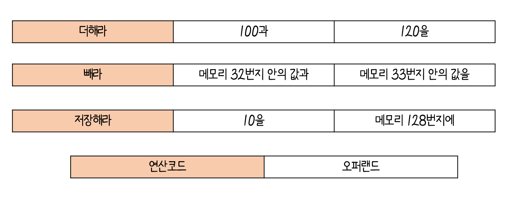
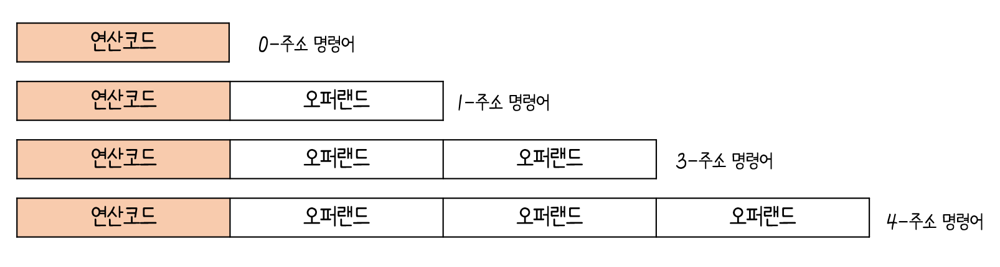
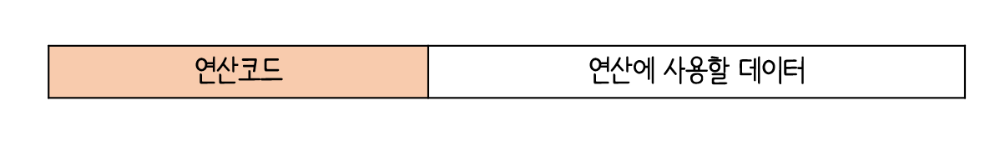
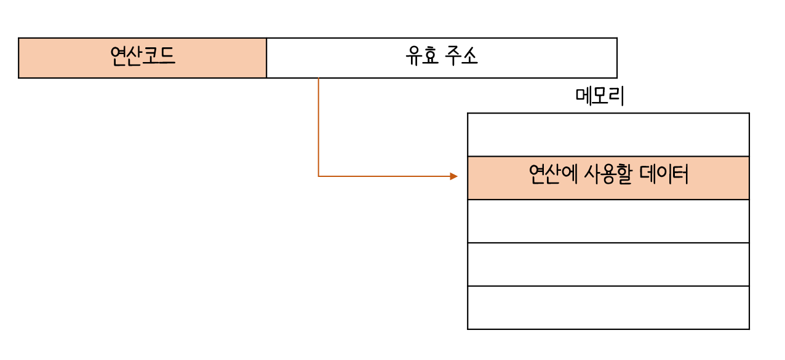
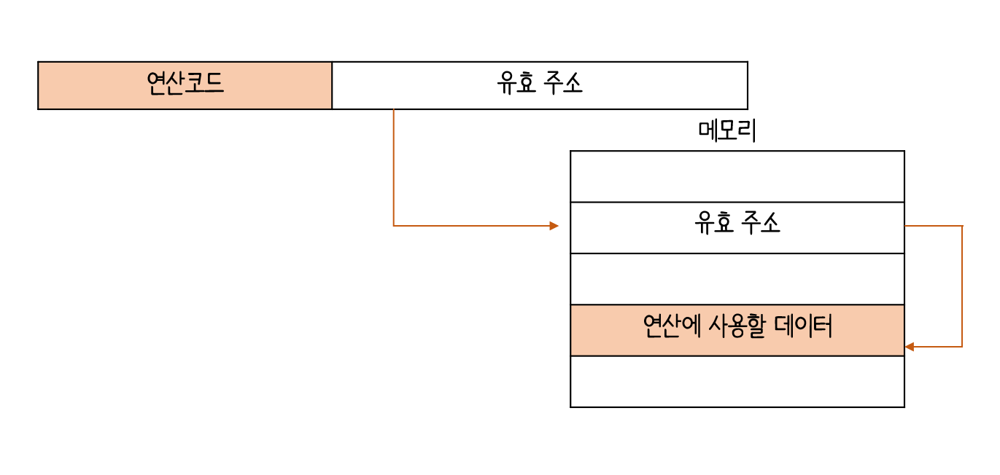
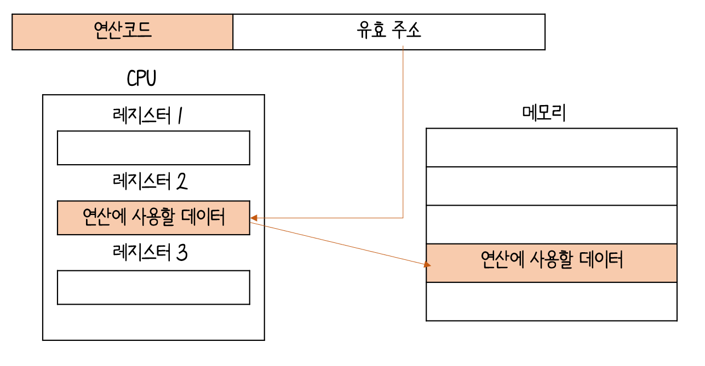

# 3. 명령어 :desktop_computer:

## 3 - 1 소스 코드와 명령어

### 고급 언어와 저급 언어

`고급 언어(high-level programming language)`

: 컴퓨터는 이해하는 언어가 아닌 사람이 이해하고 작성하기 쉽게 만들어진 언어

<i><b>고급 언어로 작성된 소스코드가 실행되려면 반드시 저급 언어, 즉 명령어로 변화되어야함</b></i>

`저금 언어(los-level programming language)`

:  컴퓨터가 직접 이해하고 실행할 수 있는 언어(오직 저급 언어만 가능)

- `기계어(machine code)` : 0 과 1의 명령어 비트로 이루어진 언어
- `어셈블리어(assembly language) `: 0과 1로 표현된 명령어(기계어)를 읽기 편한 상태로 번역한 언어

---

### 컴파일 언어와 인터프리터 언어

#### 컴파일 언어(ex. C)

: 컴파일러에 의해 소스 코드 전체가 저급 언어로 변환되어 실행되는 고급 언어

`컴파일(compile)`

: 코드 전체가 저급 언어로 변환되는 과정

`컴파일러(compiler)`

: 컴파일을 수행해 주는 도구

- 소스 코드 전체를 다 보면서 문법적인 오류, 실행 가능한 코드인지, 불필요한 코드는 없는지 다 확인
- 확인 후 저급 언어로 컴파일
- 소스 코드 내에서 오류를 발견하면 소스 코드는 컴파일에 실패

`목적 코드(object code)`

: 컴파일의 결과로 생성되는 코드

#### 인터프리터 언어(ex. python)

: 인터프리터에 의해 소스 코드가 한 줄씩 실행되는 고급 언어

`인터프리터(interpreter)`

:  소스 코드를 한 줄씩 저급 언어로 변화하여 실행해 주는 도구

- 소스 코드 전체를 저급 언어로 변환하는 시간을 기다릴 필요 :x:
- 소스 코드를 한 줄씩 실행하기 때문에 소스 코드 N번째 줄에 문법 오류가 존재하면 N-1번째 줄까지는 올바르게 수행
- 목적 코드는 컴퓨터가 이해하고 실행할 수 있는 저급 언어인 반면, 인터프리터 언어는 소스 코드 마지막까지 한 줄씩 저급 언어로 해석하면 실행 :arrow_right: 컴파일 언어가 인터프리터 언어보다 빠름

---

## 3 - 2 명령어의 구조

### 연산자와 오퍼랜드

`명령어` =  연산 코드 + 오퍼랜드

#### 오퍼랜드

- 연산에 사용할 데이터 또는 연산에 사용할 데이터가 저장된 위치
- 피연산자
- 오퍼랜드가 담기는 영역 :arrow_right:`오퍼랜드 필드`( =  `주소필드 `)
- 연산에 사용할 데이터를 명시하기보다는 메모리 주소나 레지스터 이름을 남김

`주소 필드` = 오퍼랜드 필드

#### 연산 코드

- 명령어가 수행할 연산
- 연산자
- 연산 코드가 담기는 영역 :arrow_right:`연산 코드 필드 `

##### 데이터 전송 연산 코드

- <b>MOVE</b>: 데이터를 옮겨라
- <b>STORE</b>:메모리에 저장하라
- <b>LOAD (FETCH)</b>: 메모리에서 CPU로 데이터를 가져와라
- <b>PUSH</b>: 스택에 데이터를 저장하라
- <b>POP</b>: 스택의 최상단 데이터를 가져와라

##### 산술/논리 연산 코드

- <b>ADD, SUBTRACT, MULTIPLY, DEVIDE</b>: 덧셈, 뺄셈, 곱셈, 나눗셈을 수행하라
- <b>INCREMENT, DECREMENT</b>: 오퍼랜드에 1을 더하라/ 빼라
- <b>AND, OR, NOT</b>: 논리 연산 AND, OR, NOT을 수행하라
- <b>COMPARE</b>: 두 개의 숫자 또는 TRUE / FALSE 값을 비교하라

##### 제어 흐름 변경 연산 코드

- <b>JUMP</b>: 특정 주소로 실행 순서를 옮겨라
- <b>CONDITIONAL JUMP</b>: 조건에 부합할 때, 특정 주소로 실행 순서를 옮겨라
- <b>HALT</b>: 프로그램의 실행을 멈춰라
- <b>RETURN</b>: CALL을 호출할 때 저장했던 주소로 돌아가라

##### 입출력 제어 연산 코드

- <b>READ (INPUT)</b>: 특정 입출력 장치로부터 데이터를 읽어라
- <b>WRITE (OUTPUT)</b>: 특정 입출력 장치로 데이터를 써라
- <b>START IO</b>: 입출력 장치를 시작하라
- <b>TEST IO</b>: 입출력 장치의 상태를 확인하라

---

### 주소 지정 방식

`유효 주소(effective address)`

: 연산 코드에 사용할 데이터가 저장된 위치, 즉 연산의 대상이 되는 데이터가 저장된 위치

`주소 지정 방식(addressing mode)`

: 오퍼랜드 필드에 데이터가 저장된 위치를 명시 할 때 연산에 사용할 데이터 위치를 찾는 방법

##### 즉시 주소 지정 방식

- 연산에 사용할 데이터를 오퍼랜드 필드에 직접 명시하는 방식
- 장점 : 연산에 사용할 데이터를 메모리나 레지스터로 찾는 과정 :x:그래서 다른 지정 방식보다 빠름
- 단점 : 데이터의 크기가 작아짐

##### 직접 주소 지정 방식

- 오퍼랜드 필드에 유효 주소를 직접적으로 명시하는 방식
- 장점 : 오퍼랜드 필드에서 표현할 수 있는 데이터의 크기가 즉시 지정 방식보다 커짐
- 단점 : 유효 주소를 표현할 수 있는 범위가 연산 코드의 비트 수 만큼 줄었음

##### 간접 주소 지정 방식

- 유효 주소의 주소를 오퍼랜드 필드에 명시
- 장점 :  직접 주소 지정 방식보다 표현할 수 있는 유효 주소의 범위가 넓어짐
- 단점 : 두 번의 접근이 필요하기 때문에 일반적으로 느린 방식

##### 레지스터 주소 지정 방식

- 연산에 사용할 데이터를 저장한 레지스터를 오퍼랜드 필드에 직접 명시하는 방법
- 장점 : CPU 내부에 있는 레지스터에 접근하는 것이 더 빠름
- 단점 : 표현할 수 있는 레지스터 크기에 제한:o:

##### 레지스터 간접 주소 지정 방식

- 연산에 사용할 데이터를 메모리에 저장하고, 그 주소(유효 주소)를 저장한 레지스터를 오퍼랜드 필드에 명시하는 방법
- 장점 : 간접 주소 지정 방식보다 빠름

