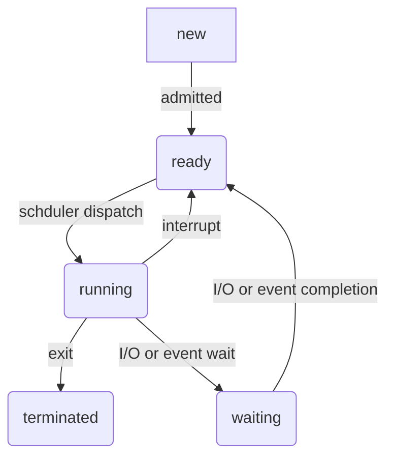
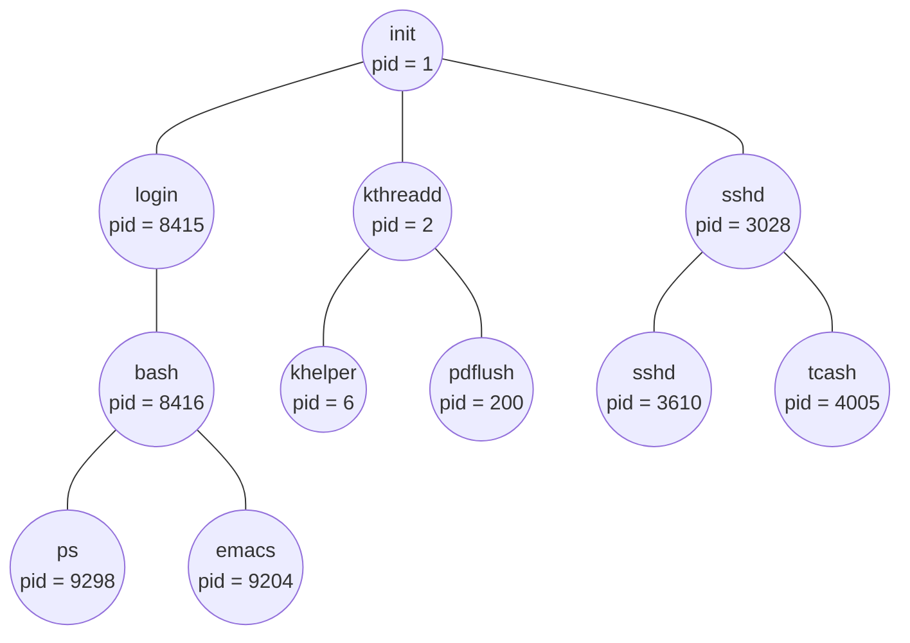

# 프로세스(Process)

`프로세스` 

- 실행중인 프로그램
- 운영체제 입장 : 작업의 단위
- 작업 완료를 위해서 특정 자원이 필요
  - CPU time
  - memory
  - files
  - I/O devices

## 프로세스의 메모리 영역

- `코드 영역(Text section)`
  - 실행가능한 코드
  - 읽기 전용(read-only)
- `데이터 영역(Data section)`
  - 프로그램이 실행되는 동안 유지할 데이터가 저장되는 공간
  - 전역 변수(global variable)
- `힙 영역(Heap section)`
  - 직접 할당할 수 있는 저장 공간
  - 공간을 할당했다면 언젠가는 해당 공간을 반환해야함
  - `메모리 누수(memory lack)` : 반환하지 않는다면 할당한 공간은 메모리 내에 남아서 메모리 낭비를 초래
- `스택 영역(Stack section)`
  - 데이터를 일시적으로 저장하는 공간
  - 매개변서, 지역 변수
- 정적 할당 영역 :arrow_right: 코드 영역, 데이터 영역
- 동적 할당 영역 :arrow_right: 힙 영역, 스택 영역

## 프로세스 상태

- `생성상태(New)` : 프로세스 생성 상태
- `준비상태(ready)` : CPU를 할당받아 실행할 수 있지만, 자신의 차례가 아니기에 기다리고 있는 상태
- `실행상태(running)` : CPU를 할당받아 실행 중인 상태
- `대기상태(waiting)` : 특정 이벤트가 일어나길 기다리는 상태
- `종료상태(terminated)` : 프로세스가 종료된 상태

## PCB

`PCB(Process Control Block)` :

- 프로세스와 관련된 정보를 저장하는 자료 구조
- 커널 영역에 생성
- 특정 프로세스를 식별하고 해당 프로세스를 처리하는 데 필요한 정보를 판단
- 실행이 끝나면 폐기됨

### PCB에 담기는 정보

- 프로세스 ID (PID) : 특정 프로세스를 식별하기 위해 부여하는 고유한 번호
- 프로세스 상태
- Program Counter
- 레지스터 값
-  CPU 스케줄링 정보
- 메모리 관리 정보
- 사용한 파일과 입출력장치 목록

## 문맥 교환

- `문맥(context)` : 하나의 프로세스 수행을 재개하기 위해 기억해야 할 정보

- `문맥 교환(context switch)` 

  - 기존 프로세스의 문맥을 PCB에 백업
  - 새로운 프로세스를 실행하기 위해 문맥을 PCB로 복구하여 새로운 프로세스를 실행\

  

## 프로세스 계층 구조

- `fork()` : 자신의 복사본을 자식 프로세스로 생성
- `exec() ` : 자신의 메모리 공간을 다른 프로그램으로 교체
- 실행 방법
  - 부모와 자식이 동시에 실행
  - 자식이 종료될 때(terminated) 될 떄까지 부모가 기다림(wait)
- 메모리
  - 자식은 부모를 복제
  - 자식은 새로운 프로그램을 load함
- `좀비 프로세스(zombie process)` : 부모 프로세스가 wait 하지 않고 계속 일을 하는 프로세스
- `고아 프로세스(orpahn process)` : 아예 wait도 하지 않고 terminated한 부모를 가진 프로세스