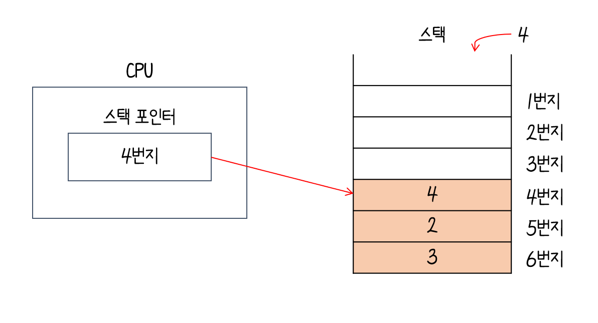
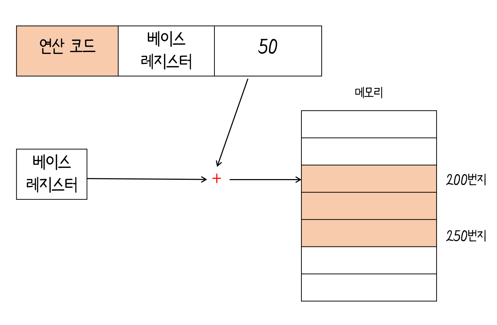

# 레지스터의 종류

`프로그램 카운터(PC : Program Counter)` 

- 메모리에서 가져올 명령어의 주소, 메모리에서 읽어 들일 명령어의 주소를 저장
- `명령어 포인터(IP : Instruction Pointer)`라고도 불림

`명령어 레지스터(IR : Instruction Register)`

- 메모리에서 읽어 들인 명령어를 저장하는 레지스터
- 해석한 뒤 제어 신호를 보냄

`메모리 주소 레지스터(MAR : Memory Address Register)`

- 메모리 주소를 저장하는 레지스터
- CPU가 읽어들이고자 하는 주소 값을 주소 버스로 보낼 떄 거치게 됨

`메모리 버퍼 레지스터(MBR : Memory Buffer Register)`

- 메모리와 주고받을 값(데이터와 명령어)을 저장하는 레지스터
- 메모리에 쓰고 싶은 값이나 메로리로부터 전달받은 값은 메모리 버퍼 레지스터를 거침
- 데이터 버스로 주고 받을 값은 메모리 버퍼 레지스터를 거치게됨
- `메모리 데이터 레지스터(MDR : Memory Data Register)`라고도 불림

`범용 레지스터(general purpose register)`

- 다양하고 일반적인 상황에서 자유롭게 사용할 수 있는 레지스터
- 데이터와 주소를 모두 저장 가능 :o:

`플래그 레지스터(flag register)`

- 연산 결과 또는 CPU 상태에 대한 부가적인 정보를 저장하는 레지스터

`스택 포인터(stack pointer)`

- 스택의 꼭대기를 가르키는 레지스터
- 스택 포인터와 스택을 이용한 주소 지정 방식 :arrow_right: 스택 주소 지정 방식

`베이스 레지스터(base register)`

- 베이스 레지스터 주소 지정 방식에서 '기준 주소' 역할을 함.

---

# 스택 주소 지정 방식

- 스택과 스택 포인터를 이용한 주소 지정 방식

- 스택 포인터는 데이터가 어디까지 채워져있는지에 대한 표시

  

- 데이터를 꺼내는 경우

  

- 데이터를 추가하는 경우

  

- `스택 영역` :arrow_right: 메모리 안에 정해진 스택처럼 사용할 영역

  

---

# 변위 주소 지정 방식(displacement addressing mode)

- 오퍼랜드 필드의 값(변위)과 특정 레지스터의 값을 더하여 유효 주소를 얻어내는 주소 지정 방식

## 상대 주소 지정 방식(relative addressing mode)

- 오퍼랜드와 프로그램 카운터의 값을 더하여 유효 주소를 얻는 방식

  

## 베이스 레지스터 주소 지정 방식base-register addressing mode

- 오퍼랜드와 베이스 레지스터의 값을 더하여 유효 주소를 얻는 방식

- 베이스 주소 :arrow_right: 기준주소 , 오퍼랜드 :arrow_right: 기준 주소로부터 떨어진 거리

  

