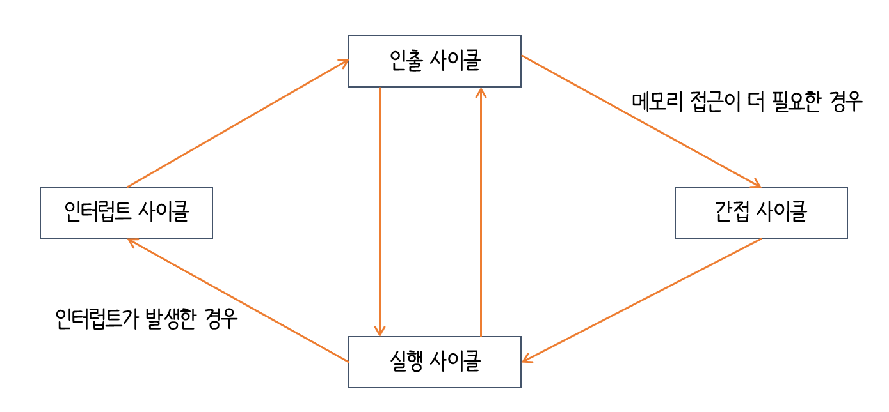

# 명령어 사이클

`명령어 사이클(instruction cycle)` : 명령어들이 일정하게 반복되는 주기

- `인출 사이클(fetch cycle)` : 메모리에 있는 명령어를 CPU로 가지고 오는 단계
- `실행 사이클(execution cycle)` : 제어장치가 명령어 레지스터에 담긴 값을 해석하고, 제어 신호를 발생시키는 단계
- 프로그램을 이루는 명령어들은 인출과 실행 사이클을 반복 실행
- `간접 사이클(indirect cycle)` :  간접 주소 방식일 경우 명령어를 실행하기 위해 메모리 접근을 한 번 더 하는 사이클

---

# 인터럽트

`인터럽트(interrupt)` : CPU의 작업을 방해하는 신호

- `동기 인터럽트(synchronous interrupts)` 
  - CPU에 의해서 발생하는 인터럽트
  - **예외(exception)**이라고 부름
- `비동기 인터럽트(asynchronous interrupts)`
  - 입출력장치에 의해 발생하는 인터럽트
  - 알림과 같은 인터럽트
  - **하드웨어 인터럽트**라고 함

## 하드웨어 인터럽트 처리 순서

1. 입출력 장치는 CPU에 **인터럽트 요청 신호**를 보냅니다.
2. CPU는 실행 사이클이 끝나고 명령어를 인출하기 전 <i>항상</i> 인터럽트 여부를 확인합니다.
3. CPU는 인터럽트 요청을 확인하고 **인터럽트 플러그**를 통해 현재 인터럽트를 받아들일 수 있는지 여부를 확인합니다.
4. 인터럽트를 받아들일 수 있다면 CPU는 지금까지의 작업을 백업합니다.
5. CPU는 **인터럽트 백터**를 참조하여 **인터럽트 서비스 루틴**을 실행합니다.
6. 인터럽트 서비스 루틴 실행이 끝나면 백업을 해둔 작업을 복구하여 재개

- 인터럽트 요청 신호 : CPU의 작업을 방해하는 인터럽트에 대한 요청
- 인터럽트 플래그 : 인터럽트 요청 신호를 받아들일지 무시할지를 결정하는 비트
- 인터럽트 백터 : 인터럽트 서비스 루틴의 시작 주소를 포함하는 인터럽트 서비스 루틴의 식별 정보
- 인터럽트 서비스 루틴 : 인터럽트를 처리하는 프로그램

