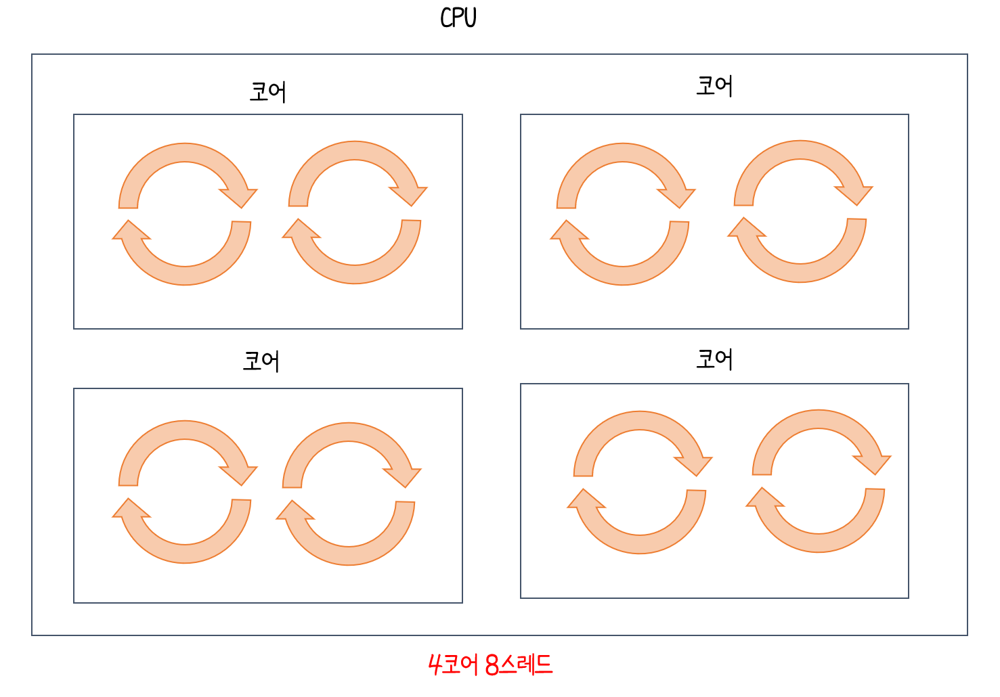
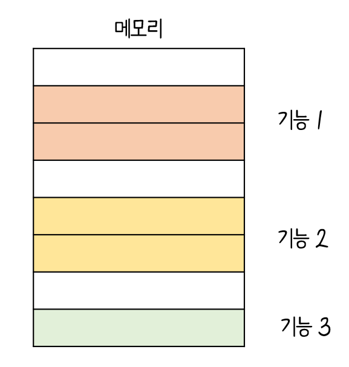

# 클럭

- 클럭 속도가 높아짐 :arrow_right: CPU는 명령어 사이클이 더 빠르게 반복
- `클럭 속도` : 헤르츠(Hz) 단위로 측정(1초에 100번 반복 :arrow_right: 100Hz )
- `오버클럭킹(overcolocking)` : 클럭 속도를 유지하기보다는 고성능을 요하는 순간에 순간적으로 클럭 속도를 높이고, 그렇지 않을 때는 유연하게 클럭 속도를 낮추어주고 최대 클럭 속도를 강제를 끌어올릴 수 있는 기법

---

# 코어와 멀티코어

- `코어(core)` : 명령어를 실행하는 부품

- `멀티코어(multi-core)` 또는 `멀티코어 프로세서` : 코어를 여러 개 포함하고 있는 CPU

   

- CPU 의 연산 속도가 꼭 코어 수에 비례하여 증가 :x:

- 처리하고자 하는 작업량보다 코어 수가 지나치게 많아도 성능에는 크게 영향:x:

---

# 스레드와 멀티 스레드

`스레드(Thread)` 

- 사전적 : 실행 흐름의 단위
- CPU에서 사용 :arrow_right: **하드웨어적 스레드** , 프로그램에서 사용 :arrow_right: **소프트웨어적 스레드**

`하드웨어적 스레드`

- 하나의 코어가 동시에 처리하는 명령어 단위
- 4 코어 8 스레드 :arrow_right: 명령어를 실행하는 부품은 4개,  한 번에 8개의 명령어를 처리
- `멀티스레드 프로세서` 또는 `멀티스레드 CPU` :arrow_right: 하나의 코어로 여러 명령어를 동시에 처리하는 CPU

`소프트웨어적 스레드`

- 하나의 프로그램에서 <u>독립적</u>으로 실행되는 단위

  

`멀티스레드 프로세서`

- 명령어 처리에 필요한 **레지스터**를 여러 개 가짐
- 하드웨어 프로세서를 `논리 프로세서`라고도 부름